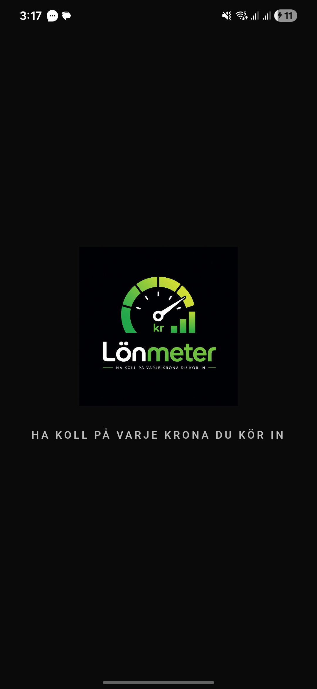
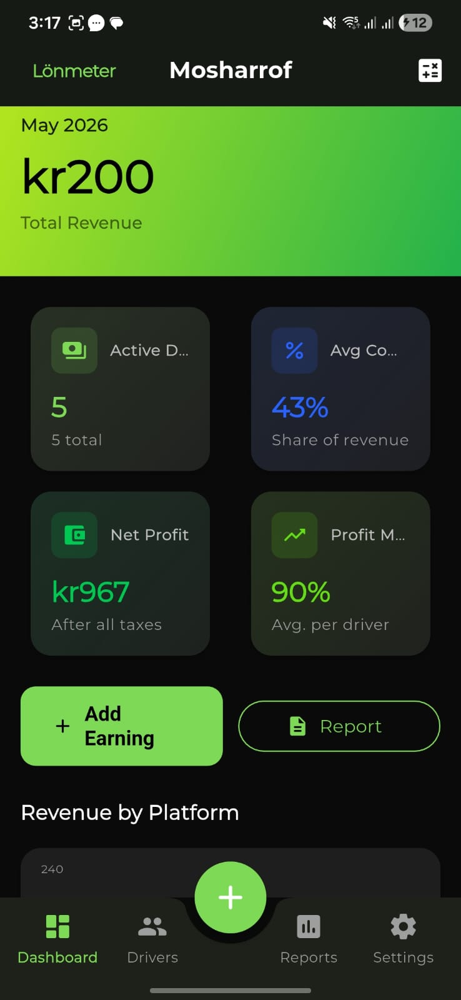
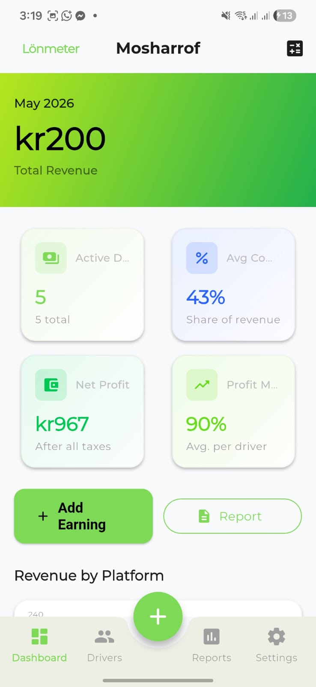
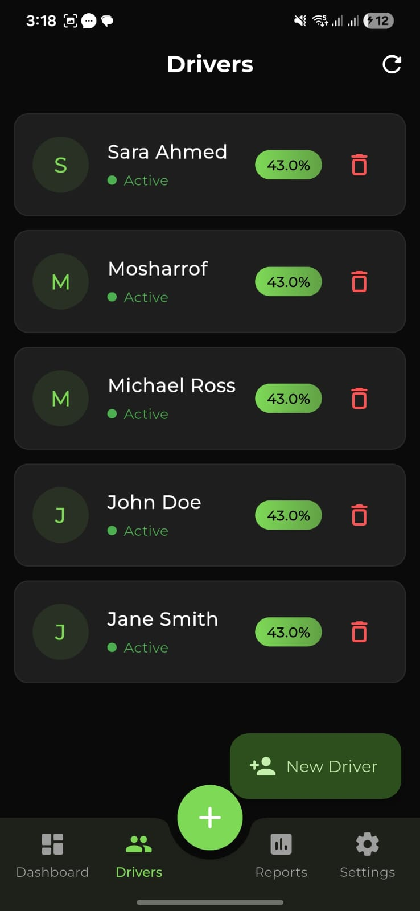
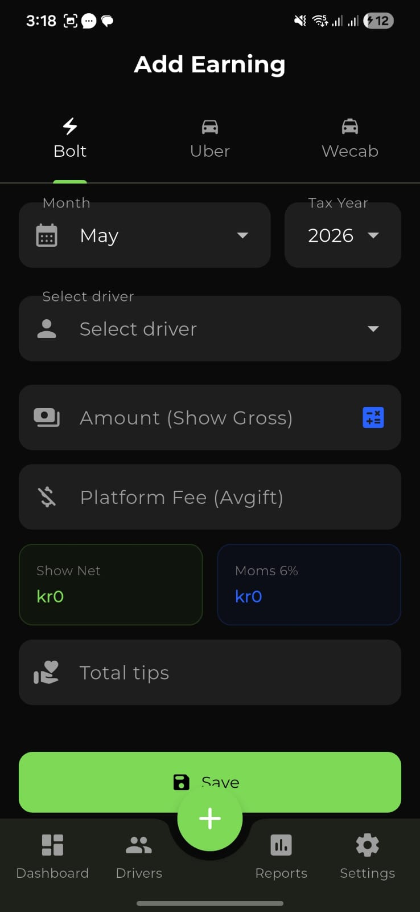
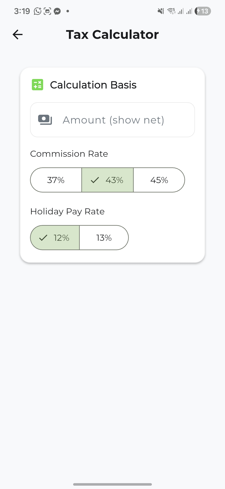
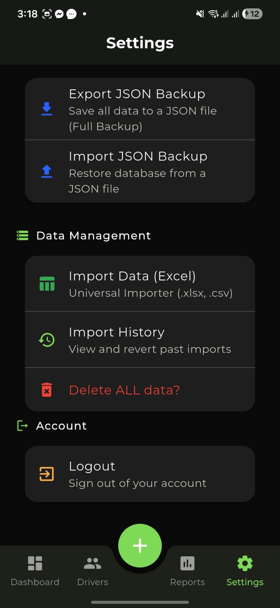

# Lönmeter 🇸🇪

**A Professional Swedish Fleet Payroll & Financial Management System.**

Lönmeter is a scalable, offline-first payroll engine designed specifically for Swedish fleet operations (Uber, Bolt, etc.). It automates the complex process of calculating driver commissions, employer contributions, and tax obligations while ensuring strict compliance with Swedish accounting standards.

---

## 🚀 Core Features

### 📊 Swedish Tax Standard Compliance
Lönmeter is built with the Swedish fiscal model at its core:
- **Automated Social Fees**: Precise calculation of *Arbetsgivaravgifter* (Default: 31.42%).
- **FORA Pensions**: Integrated pension and insurance fee tracking (Default: 4.5%).
- **Tax Withholding**: Automated 30% Preliminary Tax (*Preliminärskatt*) calculations.
- **Tips Distribution**: 100% distribution of tips to drivers as per standard regulations.

### 🔌 Smart Data Ingestion
- **Dynamic CSV/Excel Parsing**: Import data directly from Uber, Bolt, and other platforms.
- **Flexible Fee Mapping**: Intelligent column mapping to handle varying platform report structures.
- **Conflict Resolution**: Advanced handling for driver name mismatches and duplicate entries.

### 📱 Premium UX/UI
- **Real-time State Management**: Powered by Riverpod for an ultra-responsive, reactive interface.
- **Offline-First Architecture**: Work anywhere with local Hive storage; sync to the cloud when online.
- **Multi-language Support**: Seamless toggle between **English** and **Svenska**.
- **Professional Exports**: Generate and share Monthly Report PDF and Excel documents directly from the app.

---

## 🛠 Tech Stack

- **Framework**: [Flutter](https://flutter.dev) (Cross-platform)
- **State Management**: [Riverpod](https://riverpod.dev)
- **Database (Local)**: [Hive](https://pub.dev/packages/hive) (NoSQL)
- **Backend/Sync**: [Supabase](https://supabase.com) (Postgres + Auth)
- **Charts**: [FL Chart](https://pub.dev/packages/fl_chart)
- **PDF Generation**: [Pdf](https://pub.dev/packages/pdf)

---

## 📂 Project Structure

```text
lib/
├── models/         # Data structures (Driver, Earnings, Payroll)
├── providers/      # State management logic
├── screens/        # Feature screens (Dashboard, Settings, etc.)
├── services/       # Core business logic (Tax Calc, Export, Import)
├── utils/          # Constants (Tax rates) and Formatters
├── widgets/        # Reusable UI components
├── main.dart       # App entry & Initialization
└── router.dart     # Navigation configuration
```

---

## 📸 App Preview

### UI Showcase

| Splash Screen | Dashboard (Dark) | Dashboard (Light) |
| :---: | :---: | :---: |
|  |  |  |

| Drivers List | Monthly Report | Add Earning |
| :---: | :---: | :---: |
|  |  |  |

| Tax Calculator | Settings (General) | Settings (Advanced) |
| :---: | :---: | :---: |
|  |  |  |

---

## ⚙️ Installation & Setup

### Prerequisites
- Flutter SDK (Latest Stable)
- Dart SDK
- Supabase Project (for Cloud Sync)

### Steps
1. **Clone the repository:**
   ```bash
   git clone https://github.com/your-repo/lonmeter.git
   cd lonmeter
   ```

2. **Install dependencies:**
   ```bash
   flutter pub get
   ```

3. **Configure Environment:**
   Create a `.env` file in the root directory and add your Supabase credentials:
   ```env
   SUPABASE_URL=your_project_url
   SUPABASE_ANON_KEY=your_anon_key
   ```

4. **Run the application:**
   ```bash
   flutter run
   ```

---

## ⚖️ License & Copyright

**Copyright © 2026 Md. Mosharrof Hossain / AdmiroTech. All Rights Reserved.**

This software and its associated documentation are proprietary and confidential. Unauthorized copying, modification, or distribution of this software, via any medium, is strictly prohibited.

> **Client Authorization sub-note:** 
> Explicit usage and deployment rights are granted to the specific authorized client for their private fleet operations. This authorization does not include the right to resell, redistribute, or license the software to third parties.

---

**Built with ❤️ for Swedish Fleet Owners.**
